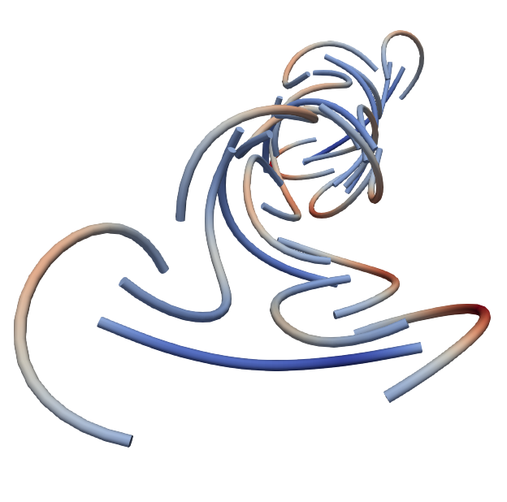

# MeshPy: A general purpose 3D beam finite element input generator

MeshPy is a general purpose 3D beam finite element input generator written in `python3`.
It contains basic geometry creation and manipulation functions to create complex beam geometries, including rotational degrees of freedom for the beam nodes.
It can be used to create input files for the following finite element solvers:
- [4C](https://www.4c-multiphysics.org/) (academic finite element solver)
- [Abaqus](https://en.wikipedia.org/wiki/Abaqus) (commercial software package)

MeshPy can easily be adapted to create input files for other solvers.
MeshPy is developed at the [Institute for Mathematics and Computer-Based Simulation (IMCS)](https://www.unibw.de/imcs-en) at the Universität der Bundeswehr München.


## Download MeshPy

The current MeshPy `main` branch is hosted on [GitHub](https://github.com/imcs-compsim/meshpy).


## How to cite MeshPy?

Whenever you use or mention MeshPy in some sort of scientific document/publication/presentation, please cite MeshPy as follows:

```
Steinbrecher, I., Popp, A.: MeshPy -- A general purpose 3D beam finite element input generator, https://imcs-compsim.github.io/meshpy
```

With the following BiBTeX entry:

```TeX
@Misc{MeshPyWebsite,
  author       = {Steinbrecher, I. and Popp, A.},
  howpublished = {\url{https://imcs-compsim.github.io/meshpy}},
  title        = {{M}esh{P}y -- {A} general purpose {3D} beam finite element input generator},
  year         = {2021},
  key          = {MeshPyWebsite},
  url          = {https://imcs-compsim.github.io/meshpy},
}
```



## Contributors

**Main developer**

Ivo Steinbrecher

**Contributors** (in alphabetical order)

Dao Viet Anh

Nora Hagmeyer

Matthias Mayr


## Publications
[comment]: <> (ASME style in JabRef)

Journal publications in which MeshPy has been used:

### 2024

-  Firmbach, M., Steinbrecher, I., Popp, A., Mayr, M., 2024, “Physics-based block preconditioning for mixed-dimensional beam-solid interaction“, submitted, [arXiv:2402.18414](https://arxiv.org/abs/2402.18414)

- Hagmeyer, N., Mayr, M., and Popp, A., 2024, “A Fully Coupled Regularized Mortar-Type Finite Element Approach for Embedding One-Dimensional Fibers into Three-Dimensional Fluid Flow,” International Journal for Numerical Methods in Engineering, 125(8), p. e7435, doi: [10.1002/nme.7435](https://doi.org/10.1002/nme.7435)

### 2023

- Hagmeyer, N., 2023, “A Computational Framework for Balloon Angioplasty and Stented Arteries Based on Mixed-Dimensional Modeling,” Universität der Bundeswehr München, PhD thesis, [Available online](https://athene-forschung.rz.unibw-muenchen.de/146359)

### 2022

- Steinbrecher, I., 2022, “Mixed-Dimensional Finite Element Formulations for Beam-to-Solid Interaction,” University of the Bundeswehr Munich, PhD thesis, [Available online](https://athene-forschung.unibw.de/143755)

- Steinbrecher, I., Popp, A., and Meier, C., 2022, “Consistent Coupling of Positions and Rotations for Embedding 1D Cosserat Beams into 3D Solid Volumes,” Computational Mechanics, 69(3), pp. 701–732, doi: [10.1007/s00466-021-02111-4](https://doi.org/10.1007/s00466-021-02111-4)

- Steinbrecher, I., Meier, C., Popp, A.: A consistent mixed-dimensional coupling approach for 1D Cosserat beams and 2D solid surfaces, 2022, submitted, [arXiv.2210.16010](https://doi.org/10.48550/arXiv.2210.16010)

- Hagmeyer, N., Mayr, M., Steinbrecher, I., and Popp, A., 2022, “One-Way Coupled Fluid-Beam Interaction: Capturing the Effect of Embedded Slender Bodies on Global Fluid Flow and Vice Versa,” Advanced Modeling and Simulation in Engineering Sciences, 9(1), p. 9., doi: [10.1186/s40323-022-00222-y](https://doi.org/10.1186/s40323-022-00222-y)

### 2020
- Steinbrecher, I., Mayr, M., Grill, M. J., Kremheller, J., Meier, C., and Popp, A., 2020, “A Mortar-Type Finite Element Approach for Embedding 1D Beams into 3D Solid Volumes,” Computational Mechanics, 66(6), pp. 1377–1398, doi: [10.1007/s00466-020-01907-0](https://doi.org/10.1007/s00466-020-01907-0)


## Examples created using MeshPy

Fiber reinforced composite plate:


Fiber reinforced pipe under pressure:


Fiber reinforcements of a twisted plate:


